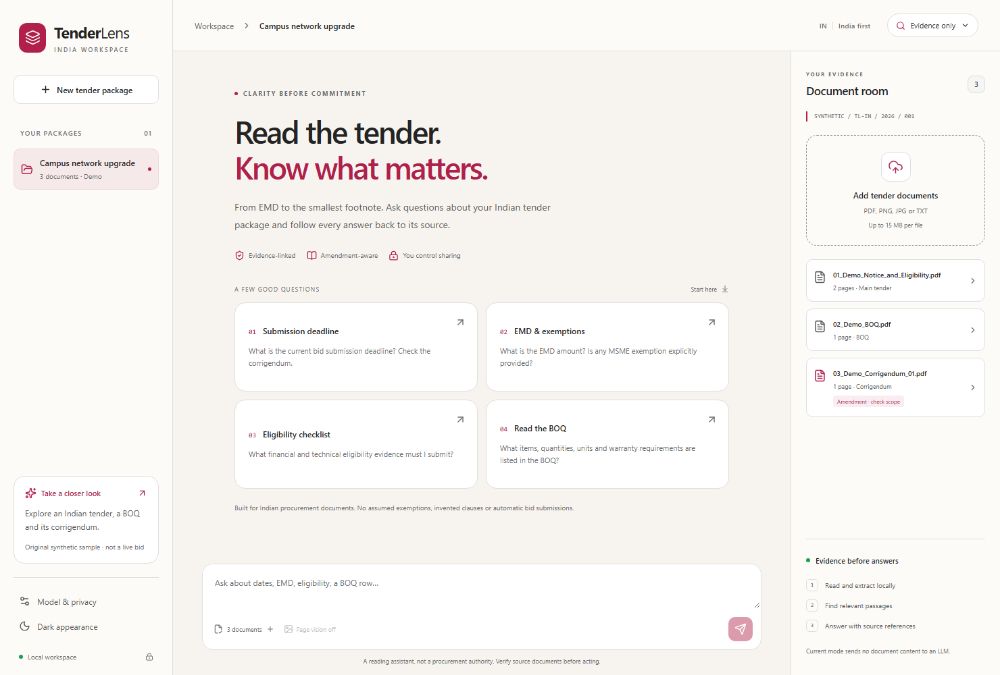

# TenderLens India

**Read the tender. Know what matters.**

An India-first workspace for tender notices, annexures, BOQs, forms and corrigenda.
Ask a question, inspect the supporting passages, and open the original source page.

**Local-first. API-first for generated answers. No training. No paid fallback.**
This is a single-user prototype, not a procurement authority, legal adviser,
bidder-eligibility certification tool or automatic bid submitter.



*The interface uses original synthetic documents. Screenshots demonstrate the
workspace, not a claim that generated answers are always correct.*

## Start here

| Question | Answer |
|---|---|
| Are we building/training a model? | No. We use pretrained OCR, optional local embeddings and an existing Gemma model. |
| API or local? | Gemma 4 through the Gemini API for generated answers; processing and retrieval stay local. |
| Can I try it without a key? | Yes. Evidence-only mode retrieves actual passages and clearly identifies itself as non-generative. |
| Does it need Python? | **No. Node.js 24 is the only runtime prerequisite.** |
| Will it enable billing? | **No.** The app requires an explicit Free-tier confirmation, restricts hosted model IDs, and never upgrades or switches to a paid model. |

## Why the Node-only runtime?

The initial Python draft could not install dependencies on the development
DevBox because its package-file host was blocked. The current implementation uses
the normally permitted npm ecosystem instead: TypeScript, Express, built-in
SQLite, PDF.js-based extraction, local Tesseract.js OCR, and React.

This is a runtime change, **not a proxy, mirror, TLS exception or network-policy
bypass**. Python is not required to run, test, extract, OCR or demonstrate the app.
The initial draft remains in Git history; it is not a second supported backend.

Lockfiles retain versions and integrity hashes but omit registry-specific
download URLs. Installs use the registry already approved/configured on your
machine; this repository does not set a registry or include registry credentials.

## Features and honest boundaries

- Group notices, annexures, BOQs and corrigenda in a single tender package.
- Ask about EMD, bid fees, GST wording, turnover, eligibility, quantities and dates.
- Inspect page-linked passages, detected PDF tables, text and original page images.
- Retain explicit amendment links without equating upload order with precedence.
- Use responsive light/dark views with visible provider, consent and failure states.

**English-first, Indian-document focus.** Hindi OCR assets are included, but
regional-language accuracy has not been established. The app does not verify
jurisdiction or automatically apply procurement law.

Supported uploads: PDF, PNG, JPG and UTF-8 TXT. **Excel/CSV BOQs and DOCX are not
supported yet.** Limits: 15 MB per file, 80 PDF pages, 20 documents per package.
Complex/scanned tables may lose column relationships; original-page review is
required. Unreadable pages and extraction failures are surfaced explicitly.

## Quick start

### Prerequisites

Use Node.js **24.x** and npm. Node 24's built-in SQLite API currently emits an
experimental-feature warning; the application pins this major version.
No Python, Docker, GPU, paid database or cloud deployment is required.

### 1. Clone and install

```powershell
git clone https://github.com/ayush-020198/tenderlens.git
cd tenderlens
npm ci
npm --prefix frontend ci
```

The repository is private. Use your authorized personal GitHub account.

### 2. Configure and build

```powershell
if (-not (Test-Path .env)) { Copy-Item .env.example .env }
npm run build
```

Do not overwrite an existing `.env`. Never put API keys in source code, `VITE_*`
variables, screenshots, dataset manifests or Git commits.

### 3. Run

```powershell
npm start
```

Open **http://127.0.0.1:8000**. Choose **Take a closer look** to load the original
synthetic Indian package. Ask about its deadline, EMD or BOQ.

The default **Evidence only** mode makes no LLM call and does not pretend to
generate an AI conclusion. Use **Model & privacy** to change the provider.
Stop the foreground server with Ctrl+C. Windows also has `scripts\start.ps1`.

### Development mode

Run the backend in one terminal:

```powershell
npm run dev:api
```

Run the frontend in another:

```powershell
npm --prefix frontend run dev
```

Open **http://127.0.0.1:5173**. Vite proxies `/api` to port 8000.

## Gemma 4: free-only setup

The [official Gemma API guide](https://ai.google.dev/gemma/docs/core/gemma_on_gemini_api)
documents these hosted models and image input:

- `gemma-4-26b-a4b-it` (default)
- `gemma-4-31b-it`

The app permits only those hosted IDs. Check current
[model pricing](https://ai.google.dev/gemini-api/docs/pricing) and account access
before use. Availability and free quotas are not guaranteed by this repository.

### Configure your key safely

1. Sign in to [Google AI Studio](https://aistudio.google.com/apikey) with your
   authorized personal account.
2. Use a project explicitly labeled **Free tier**, with billing disabled.
   **Do not add a payment method or click Set up billing.**
3. Create a dedicated key and save it only in your local `.env`.
4. Set the confirmation flag below, then restart the server.
5. Select Gemma in **Model & privacy** and approve document sharing before a request.

```dotenv
GEMINI_API_KEY=your-key-only-in-this-local-file
GEMMA_MODEL=gemma-4-26b-a4b-it
GEMINI_FREE_TIER_CONFIRMED=true
```

The confirmation flag is **your attestation**, not an independent billing audit.
The key never goes into the browser. Quota failures remain failures: the app
does not enable billing, retry through a paid model or silently change providers.

Only selected passages and recent questions from the same package are sent.
Enabling **Page vision** also sends up to two rendered source pages. Images can
contain more information than the displayed quotation.

Use public or authorized, appropriately redacted documents. Read the
[API data-use terms](https://ai.google.dev/gemini-api/terms); do not assume that
unpaid access provides confidential-data guarantees.

## Local alternatives

### Evidence search

`RETRIEVAL_MODE=bm25` works immediately without any model download. It uses a
BM25 baseline with Indian-tender terminology expansion. This is a transparent
baseline, not a claim that keyword search equals semantic retrieval.

### Optional local embeddings

If an approved local Ollama instance is available, install its embedding model:

```powershell
ollama pull embeddinggemma
```

Then configure:

```dotenv
RETRIEVAL_MODE=hybrid
EMBEDDING_MODEL=embeddinggemma
OLLAMA_BASE_URL=http://127.0.0.1:11434
```

Hybrid mode combines BM25 and local embedding rankings with reciprocal-rank fusion.
Vectors are cached locally with a model/title/content hash. Pin the model version
and clear the local embedding cache after changing downloaded model weights.
If embedding initialization
fails, the app reports it instead of silently changing retrieval methods.

**A cross-encoder reranker is not implemented in this baseline.** Add one only
after comparing measured retrieval failures on the development set.

### Optional local generation

```dotenv
OLLAMA_MODEL=qwen3.5:4b
```

Choose **Local Ollama** in the UI. A local Qwen option is not presented as Gemma.
Cloud-tagged/remote models are rejected; configure Ollama itself with
`OLLAMA_NO_CLOUD=1`. CPU inference can take minutes. Page vision requires an
image-capable local model.

## Local OCR and PDF handling

PDF text and table extraction use `pdf-parse`/PDF.js. Page previews are rendered
locally. Text extraction does not follow hyperlinks or execute PDF JavaScript.

Scanned pages and PNG/JPG images use **Tesseract.js with packaged English/Hindi
model assets**. They are installed through npm; OCR does not download language
files or send images to a cloud OCR service at runtime.

```dotenv
OCR_ENABLED=true
OCR_LANGUAGES=eng
# For an experimental English/Hindi pilot:
# OCR_LANGUAGES=eng+hin
```

OCR and table extraction can still misread amounts, units and footnotes. Their
output is not a substitute for original-page review. Entirely unreadable uploads
fail rather than appearing to upload successfully.

## Architecture

```text
React / TypeScript / Vite
          |
  Local Express / Node 24
          |
  SQLite + private upload files
          |
  PDF/text extraction + local OCR + table rows + page provenance
          |
  BM25 OR BM25 + local embeddings
          |
  Evidence only OR consent-gated free Gemma / local Ollama
          |
  Answer schema + source-ID / verbatim-quote checks
          |
  Answer + evidence cards + original page
```

Repository boundaries:

| Module | Responsibility |
|---|---|
| `server/src/documents.ts` | Extraction, OCR, upload validation and page rendering |
| `server/src/store.ts` | SQLite, source provenance and package isolation |
| `server/src/retrieval.ts` | Local candidate selection and optional hybrid ranking |
| `server/src/answering.ts` | Provider calls, free-only guard and citation checks |
| `frontend/` | Review workspace, consent and source navigation |

Uploaded documents are data, not executable instructions. No model tools, web
search, document-supplied URLs or shell commands are enabled.

## Indian sample data

### Bundled synthetic package

`fixtures/demo.json` is original fictional material: a notice, eligibility rules,
a BOQ and a date-only corrigendum. All dates, institutions and amounts are
fictional; the future-dated amendment is an intentional test scenario.

`datasets/synthetic-development.json` contains ten development questions with
expected answers and required source documents. It is **not training data,
not a held-out benchmark and not real procurement advice**.

### Official historical documents, kept out of Git

`datasets/sources.json` records an IISc Bengaluru archive, a 2021 wall-mounted-fan
tender and its listed corrigendum. These are historical reading examples,
**not active procurement opportunities**.

```powershell
npm run samples -- --acknowledge-source-terms
```

Files go to `data/public/iisc-wall-fans-2021/` with SHA-256 receipts. The downloader
allows only manifest-listed official hosts, checks file size/signatures/hashes,
and stops on unexpected redirects. It does not bypass CAPTCHA, login or access
controls. Review the actual reference and amendment scope before linking documents.

Real PDFs are not committed or redistributed. Public access does not itself
establish a training or redistribution license; publisher terms still apply.

### Why no random Kaggle dataset?

The first need is an Indian tender package with authoritative source evidence,
not an unrelated document benchmark. No Kaggle credential is required.
A future Kaggle source must be checked for Indian coverage, original-document
provenance, license, duplicates and usable annotations.

For a real pilot, collect 10-20 permitted packages and 200-500 human-reviewed
questions. Separate development and untouched test packages; keep a tender and
all its amendments together. Near-identical templates should not leak across splits.

## Run the checks locally — no hosted-runner charge

```powershell
npm run check
npm run build
npm run test:e2e
```

The backend suite uses Node's test runner. It exercises package isolation,
consent/free-tier gates, invalid uploads, PDF previews, OCR, amendments, provider
request shape and citation rejection. Hosted API requests are mocked in this suite.

Playwright uses installed **Microsoft Edge** locally and starts/stops its own API
server with separate data. It does not use your personal browser profile.

For a UI-only contract check:

```powershell
$env:MOCK_API = "1"
npm run test:e2e
Remove-Item Env:MOCK_API
```

Mock-mode checks are **not** backend or model validation.

### Development retrieval report

```powershell
npm run evaluate:retrieval
```

This reports expected synthetic source-document and exact page/evidence-span
coverage, not LLM answer accuracy.
Measure extraction errors, evidence recall, claim support, amendment handling,
abstention, latency and cost separately.

### Optional GitHub Actions

Hosted checks are **manual and gated off by default**. They do not run on a push.
Before enabling them, independently verify available free Actions allowance and
a no-spend safeguard in your personal account.

The workflow requires both the repository variable `FREE_CI_CONFIRMED=true`
and an explicit dispatch confirmation. The default setup keeps the variable false.
Hosted Actions execution is also disabled in this repository's settings; only
re-enable it after verifying a no-spend account configuration.
There are no paid fallbacks, stored runner artifacts or automatic deployments.
Running local checks is sufficient to develop this prototype.

## Configuration

| Variable | Default | Meaning |
|---|---|---|
| `GEMINI_API_KEY` | empty | Server-only key |
| `GEMMA_MODEL` | `gemma-4-26b-a4b-it` | Restricted hosted-model choice |
| `GEMINI_FREE_TIER_CONFIRMED` | `false` | User confirms project billing is disabled |
| `TENDERLENS_DATA_DIR` | `./data` | Database, originals and local caches |
| `RETRIEVAL_MODE` | `bm25` | `bm25` or `hybrid` |
| `EMBEDDING_MODEL` | `embeddinggemma` | Optional local Ollama embedder |
| `OCR_ENABLED` | `true` | Local OCR for scans |
| `OCR_LANGUAGES` | `eng` | `eng`, `hin` or `eng+hin` |
| `OLLAMA_BASE_URL` | `http://127.0.0.1:11434` | Loopback only |
| `OLLAMA_MODEL` | `qwen3.5:4b` | Explicit local-generation alternative |
| `PORT` | `8000` | Local HTTP port |

## Privacy and deployment limits

- Files, extracted text, embeddings and chat history are stored unencrypted in
  the local data directory. Protect it and retain only permitted material.
- Source-ID and quote checks do **not** prove semantic entailment, eligibility or
  legal precedence. There is no guarantee against hallucinations.
- Host/origin checks are not authentication. Other users/processes on the same
  machine are outside the prototype's isolation boundary.
- The app is a single-user local tool, not a public SaaS service. Production needs
  identity, tenant isolation, encrypted storage, retention/deletion controls,
  quotas, sandboxed workers and a separate security review.
- Do not bypass organizational package/network controls. The current app uses
  npm normally; it does not transport blocked Python packages through another host.

## Container option

No container or cloud resource is created automatically. On a permitted machine:

```powershell
docker build -t tenderlens .
docker run --rm -p 127.0.0.1:8000:8000 --env-file .env -v tenderlens-data:/app/data tenderlens
```

The image is configured for a non-root user and packages local OCR. Keep the host
port bound to loopback. Container packaging is optional and must be verified in
your target environment; it is not an Azure deployment or a free-cloud guarantee.
Loopback Ollama refers to the container itself, not your host.

## Roadmap: evaluate before training

1. Establish the pretrained OCR/retrieval/Gemma baseline.
2. Assemble permitted Indian packages and human-reviewed development/test splits.
3. Diagnose failures by component.
4. Improve extraction, chunking, retrieval, reranking or prompts where evidence
   shows a problem.
5. Consider targeted fine-tuning only if a held-out comparison demonstrates value.

Excel BOQs, stronger scanned-table structure, measured Hindi/regional-language
support, a reranker and multi-user deployment remain future work. International
expansion comes after the Indian workflow is evaluated.

## License

Application code and original synthetic fixtures: [MIT](LICENSE).
Theme/dependency notices: [THIRD_PARTY_NOTICES.md](THIRD_PARTY_NOTICES.md).
Downloaded documents, model weights and dependencies retain their own terms.
